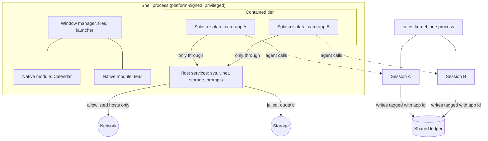

# ADR 0002: Agentic app security model — splash isolates for apps, octos sandboxes for their agents

- **Date:** 2026-09-19
- **Status:** Proposed
- **Implementation status:** Phases 1 to 4 built on 19–20 Sep 2026; phase 5 partly. **Phase 1**: `octosense-app-policy` (`crates/app-policy` in the octosense-app-hub repository) — the manifest, its admission and its resolution into both containers, 27 tests. **Phases 2–4, in the runtime** (Makepad fork, uncommitted): `widgets/src/splash_policy.rs` holds a per-heap policy the host sets once; the `host` bridge now REFUSES a `host.request` outside the granted capabilities before it is queued (§2); a URL gate in `makepad-script-std` is consulted by all three ways out of an isolate — `net.http_request`, `res.http_resource` (artwork) and the `sys.*` data fetches — against the app's exact host list, with `host:port` entries so a host can admit its own asset origin and no other loopback service (§3); a cumulative instruction budget is charged after every evaluation, callback and hook, and an exhausted isolate runs nothing further; the heap ceiling is applied to the isolate's script heap (§4). An isolate the host never put under a policy behaves exactly as before. Verified on a real card: a bundle whose artwork pointed at an outside server drew without its icons and logged nine refusals with zero outbound requests; the same card with bundled artwork drew fully. **Phase 5**: every agent session profile carries the app id and version as provenance; ledger-side tagging and cross-app reads as a granted capability are not built, because no shared ledger exists in these trees yet. Still open: per-app widget vocabulary (registration is process-wide), and a real signature verifier lives in the hub crate rather than here.
- **Scope:** What may run inside the OctoSense shell, what contains it, and what contains the agent that acts on its behalf. Covers the phone (one shell process, modules linked in) and the desktop (same shell, process hosting available). Does not cover the ROM's own privilege model, which is [ADR 0001](0001-hybrid-android-launcher-and-system-bridge.md).
- **Initial target:** OnePlus 6, Android 15 / API 35, LineageOS 22.2; macOS and Linux desktop.

## Context

OctoSense on the phone is one process. The shell, every app linked into it, and the kernel they talk to all share an address space, a user id and an SELinux domain, and in the ROM that package is platform-signed and privileged (`octosense-rom/vendor/octosense/Android.bp:5-14`, `privapp-permissions-octosense.xml:4-10`). Apps are added at compile time by a `#[cfg]` ladder (`src/apps.rs:44-57`) and hosted in-process, one isolate each (`src/module_host.rs:1-4`). This is sound while every app is first-party and built in lockstep with the shell.

Two goals break that assumption.

**A catalog.** We want apps that arrive after the build: listed, installed and run without shipping a new shell. The only unit that can do that today is data — an L0 card with its kit, which the shell renders with its own widgets — and script evaluated in a splash isolate. Native code cannot: Rust has no stable plugin ABI, and Android forbids executing code from app-writable storage, measured on device (`Octoscript-AppCard-personal/app/app/src/lib.rs:6434-6449`).

**An agent per app.** The product's value is an agent composing several apps into one surface over a shared ledger. That makes the agent a security boundary of its own: content an app fetched becomes input to decisions the agent takes with the user's authority, across apps.

Meanwhile the module contract states plainly that a module is trusted native code, and its `capabilities()` list is advisory — the only callers of it in the trees are tests (`makepad/libs/app_module/src/lib.rs:28,67`).

So the question this ADR answers is not "how do we sandbox an app" in general. It is: **which unit of code gets which container, and who enforces what.**

## Decision

Adopt three tiers, with a hard rule at the boundary between them.

1. **Trusted tier — native modules, compile-time only.** Apps written by us, linked into the shell, hosted in-process as today. They are trusted because they ship in the same build and are signed with it. Nothing in this tier is installable at runtime, ever. A third-party native library pulled into any of these apps makes the whole shell its blast radius, so taking one is a shell-level decision, not an app-level one.

2. **Contained tier — card and script apps, one splash isolate each.** Everything that arrives after the build. The unit of containment is the isolate that the displaying widget already creates (`makepad/widgets/src/splash.rs:197`), one per app surface. Its limits are set by the host at creation from the app's signed manifest, never by the app.

3. **Agent tier — one octos session per contained app.** A contained app that needs an agent gets a session in the shared kernel, not a kernel of its own. The session's profile is derived from the same manifest: its workspace is that app's storage jail, its tools are the ones the manifest declared, its network is that app's allowlist, and it carries an iteration and token budget.

**The rule at the boundary:** code that arrives after the build never runs as native code in the shell process, and never receives a permission profile above the one its manifest declares. Full access is a developer setting for machines the operator owns, not a value any manifest may request.

## What each tier enforces, and who does the enforcing

| Concern | Trusted tier | Contained tier | Agent tier |
|---|---|---|---|
| Code origin | Our build, signed with the shell | Signed bundle, hash-pinned per version | No code; a session configuration |
| Memory isolation | None (shared address space) | Own script heap per isolate | Separate kernel process |
| Vocabulary | Whole crate graph | Standard widgets, `fs`, `host`, `net` if granted (`splash.rs:136-139`) | Declared tools only |
| Filesystem | Process-wide | Jail per isolate, 1 MB per file, 16 MB total, 256 entries (`splash_storage.rs:37-41`) | Workspace = that app's jail |
| Network | Unrestricted | Off unless granted; must become a per-app host allowlist | Same allowlist |
| CPU | Unrestricted | Instruction cap per evaluation (`splash.rs:140`); must become a session budget | Iteration cap and token budget |
| Prompts to the person | Unrestricted | Per-isolate flag (`splash_host.rs:107`) | Approval gating by profile |
| Revocation | Ship a new build | Version pin plus kill switch | Disable the session |

## What already exists

- **One isolate per app surface**, created by the widget that shows it, with per-heap capability list, prompt flag and storage quota applied at creation (`makepad/widgets/src/splash.rs:197-206`, `splash_host.rs:101-117`, `splash_storage.rs:30-58`). Script can neither read nor raise its own quota.
- **A narrow default vocabulary**: the isolate's prelude is standard widgets, the jailed filesystem and the host object, plus the network module only when granted (`splash.rs:136-139`).
- **Cards as a shippable unit**: card text plus a kit read from a directory at runtime, lowered and evaluated into a live isolate (`octoscript-makepad/crates/octoscript-makepad/src/l0.rs:42-62`, `octoscript-makepad/apps/kit-host/src/beauty.rs:63,142`), with a bundle format already produced by the flow (`cards.bundle.json`).
- **Content admission**: a digest over card source, policy, level, runtime and kit, refusing anything outside the installed policy (`octoscript/crates/octoscript-ui-l0/src/approval.rs:32-58`).
- **A per-session agent sandbox**: permission profiles (read-only, workspace-write, workspace-write-never, full access), sandbox mode with a writable workspace and an explicit read allowlist, per-tool enable and disable, an iteration cap, a goal budget, and approval gating — all set per session, and exercised during the September 2026 model evaluation.
- **Signed plugin installation** in the kernel, refusing an unhashed manifest in strict mode (`octos-kernel/crates/octos-agent/src/plugins/loader.rs:578`).

## What must be built

**Phase 1 — the manifest and its binding.** A signed app bundle: identity, version, content hash, requested capabilities, host allowlist, quotas. One host-side component turns it into both configurations at once — the isolate's settings and the agent session's profile. Nothing else may set them. Without this phase the containers run on defaults, which is the current state.

**Phase 2 — enforce capabilities at the service boundary.** Today the capability list is something the code inside can ask about. Each host service must check it before acting, and each check must fail closed. This is also where the native module `capabilities()` list stops being advisory for the trusted tier, or is removed as misleading.

**Phase 3 — network becomes a list, and covers every way out.** Replace the on/off grant with a per-app set of allowed hosts, HTTPS only, enforced in the host service that performs the request and shared by the app and its agent session. The prototype showed this must include the script resource loader, not only the network module: a card with no network grant still fetched its artwork over HTTP (see findings).

**Phase 4 — budgets with teeth.** A cumulative instruction and wall-clock budget per app, a memory ceiling per isolate, a token and iteration budget per agent session, and a watchdog that ends the offender rather than degrading the shell.

**Phase 5 — provenance and revocation.** Every ledger write carries the app and session that made it; cross-app reads are a granted capability rather than an ambient one; a version pin plus a kill switch lets a bad app be stopped without a shell release.

## Findings from the phase 1 prototype

Running a real compiled card (`apps/calendar/cards/calendar-01`) through the reference host `octosense-card-host` under a manifest granting only `storage` turned up three things the design has to answer.

1. **The network grant does not cover asset loading.** With the isolate created with networking off, the card still issued **nine** HTTP requests to `http://127.0.0.1:8170/ux-images/...`, because artwork is referenced as a script resource and the resource loader is not the `net` module the grant gates. A host allowlist that only covers `mod.net` is therefore not an allowlist. Phase 3 must gate the resource loader too, and cards should carry their assets in the bundle and load them from the jail rather than from a server.
2. **Isolate vocabulary is process-wide, not per app.** The hook that gives an isolate extra widget families registers them for every isolate in the process. A card that draws with the kit needs those families, so today granting them to one card grants them to all. Per-app vocabulary, which phase 1 wants, needs a runtime change.
3. **The preview host is not a containment path.** `kit-host`'s `beauty` binary evaluates a card in the MAIN vm and swaps the resulting view into a `Splash`, so a card previewed there runs with the host's full script world. That is acceptable for a trusted developer tool and must not be confused with the device path, which hands the card's source to the isolate via `set_text`. The reference host follows the device path.

## Consequences

- An installable app can do less than a linked one, by construction. Any capability a card needs beyond drawing is a host service that must exist in the shipped shell, so "a new kind of app" still means a release even when "a new app" does not.
- Per-card isolates cost a heap and a compiled script world each. A surface composing ten cards from ten apps pays ten times. This is cheap next to processes and not free; it must be measured before the agent composes many sources at once.
- One kernel with many sessions means a per-session memory and cost profile we have not measured on the phone. That number decides whether every visible card gets a live agent or only the focused one.
- The blast radius of the trusted tier stays the whole shell. This is accepted deliberately, and is the reason tier 1 is closed to outside code.
- An agent per app multiplies model spend. Budgets are a security control and a cost control at once.

## Alternatives considered

- **Native plugins loaded at runtime.** Rejected: no stable ABI between separately built Rust artifacts, and Android blocks executing downloaded native code outright.
- **WebAssembly apps.** Rejected for now. An engine is already linked in, but it is wired to an empty import surface for numeric kernels only (`makepad/platform/script/src/math_aot/stitch_backend.rs:330-370`); giving it a way to draw and receive input is a from-scratch interface design, larger than this ADR.
- **A separate Android process and SELinux domain per app.** Rejected as the first step, kept as a later option. A second process of the same package inherits the same user id and domain, so real separation needs separate installed packages or isolated services. The blocker is not policy but rendering: the shared-swapchain path has no Android implementation (`makepad/platform/studio/src/shared_framebuf.rs:126-137`), the descriptor-passing channel is Linux only, and process hosting is compiled out on the phone (`src/host.rs:29-34`).
- **Per-card kernel process.** Rejected on cost: the kernel is an 80–130 MB binary and one process per card is unaffordable on the target device.

## Open questions

1. Per-isolate memory ceiling: the script VM exposes an instruction limit but no heap cap. Does one need to be added at the VM, or can it be approximated by quota plus watchdog?
2. Concurrent agent sessions the kernel sustains on a 6–8 GB phone, and the idle cost of one.
3. Whether the contained tier's declarative half should stay L0 cards only, or admit script that builds widget trees directly, which widens the attack surface and the vocabulary problem.
4. Who reviews and signs a third-party bundle, and what the revocation path is on a device that may be offline.
5. Whether the trusted tier's advisory `capabilities()` should be enforced for linked modules too, which would catch our own mistakes but cannot contain them.

## References

- [ADR 0001: Hybrid Android launcher and system bridge](0001-hybrid-android-launcher-and-system-bridge.md)
- Mini-program containment as prior art: dual-thread split with a host-owned bridge, per-app storage isolation with a size cap, and a registered domain allowlist per app — [container architecture](https://dev.to/ai_superapp/mini-program-container-architecture-how-dual-thread-rendering-works-3if7), [storage](https://developers.weixin.qq.com/miniprogram/en/dev/framework/ability/storage.html), [network](https://developers.weixin.qq.com/miniprogram/en/dev/framework/ability/network.html), [native renderer](https://developers.weixin.qq.com/miniprogram/en/dev/framework/runtime/skyline/introduction.html).
